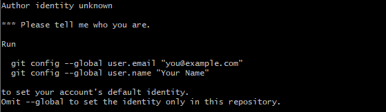
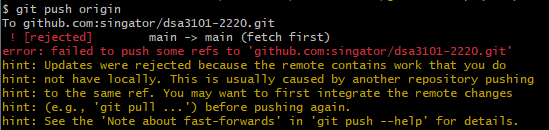
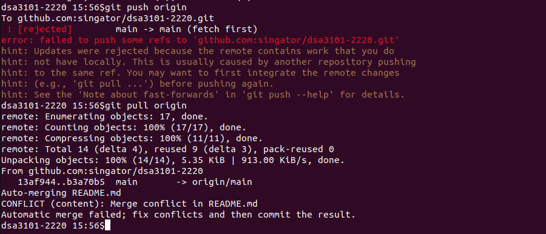
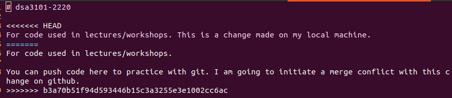

```{r load_libraries, message=FALSE, warning=FALSE, echo=FALSE}
library(tidyverse)
library(knitr)
opts_chunk$set(echo=FALSE, fig.align = 'center')
```

# Setting up git

## Name and Email configuration

Once you have installed git, it is good to carry out some initial configuration.

Open up git bash terminal and enter the following commands. They will store your 
username and email. 
````
git config --global user.name "yourname"
git config --global user.email "youremail@domain.com"
````

Without this step, you will not be able to make commits. Instead, you will 
encounter this error:
```{r echo=FALSE}

```

## Text editor configuration

When we resolve merge conflicts, or when we need to enter a merge message, git 
will open up a text editor. By default, it uses vim. However, this is not the 
preferred choice for everyone. 

With this next command, you can set it to your preferred text editor, e.g. notepad++, 
atom, etc.
````
git config --global core.editor notepad
````

## Passwordless connection to github

When working with version control software, we are encourage to make small, modular changes
frequently. Pushing and pulling to/from github will be frequently called. As we 
do not want to be entering our password every time we do so, we shall set up SSH 
keys that allow us to secure the connection to github.

SSH keys work in this way. Each individual generates a public and a private key pair.
In order to encrypt a message, only the public key is necessary. However, in order to 
decrypt a message, both the public and private keys are needed. This set-up is used 
to secure the connection between github and our machines.

To set this up, we need to generate a public-private key pair, and then share the public 
key with github. The instructions can be found 
[at this link](https://docs.github.com/en/authentication/connecting-to-github-with-ssh).

Let's go through it together.

## Cloning a repository

Open up your preferred terminal, and navigate to the directory you wish to 
save the git repository (which is essentially just another folder).

````
git clone git@github.com:singator/dsa3101-2220.git
````

We can use `git log` and `git show` to see what changes were recently made to
the repo.

````
git show -3                                   # shows last 3 commits
git log --since="1 day"                       #
git log --oneline --decorate --graph --all    # my go-to listing format
git log --oneline --pretty=format:"%h|%ae: %s"
git log --oneline --pretty=reference
````

These two commands are incredibly powerful - we can even pinpoint who made what 
changes to which lines of code with something like this:
````
git log -L222,235:7-1_Introduction_to_Clustering.tex --no-patch
````

# Making commits  

At this point, we are going to make commits to the names files. 

1. *Make a copy* of one of the names files and save it in the same folder. This 
step does not have to be done within the terminal.

````
cd dsa3101-2220/git_workshop
cp male_names.txt male_names_vik.gopal.txt
````

2. Check the status of what is happening in your repository.
````
git status
git diff
````

3. Add the file to the index, then run `git status` and `git diff` again.

4. Commit the file locally, and then run `git log`, `git status` and  
`git diff` once more. 

5. The changes to the file have been locally saved, but the rest of the class 
is not privy to them. Push the changes to github with
````
git push origin
````

6. If you encounter this error, it means that git there have been changes on the 
remote repository that you don't have. git wants you to merge your changes with it 
before pushing your changes to the remote repository.

```{r echo=FALSE}

```

## Merge conflicts

Merge conflicts arise when two members of a team edit the same line(s) of code
on their separate local repositories. The first person to push her/his changes
to the shared remote repository will not have any problems, but the second
person will encounter a merge conflict.

```{r echo=FALSE, out.width='85%'}

```

When you encounter a merge conflict, you have two options:

1. Abort the merge. You can then check the versions of the file on both branches, 
resolve them manually, and then commit your new changes.
````
git merge --abort
````

2. Resolve the merge conflict and commit the new version. The conflicting lines 
can be identified with the `<<<<<<`, `=====` and `>>>>>>` symbols. Once you have 
modified the file, add it to the staging area and commit it. You are done!

```{r echo=FALSE, out.width='85%'}


```

# Branching

To list the branches on our repository, we can use the following command
````
git branch -vv
````

To create and then checkout a new branch, we can do:
````
git switch -c test_new
````
This will create a new branch named `test_new`

If we had created a new branch on our local machine, we will need to inform 
the central repository about it, in order to track it.
````
git push --set-upstream origin test_new
````
At this point, your team-mates will be able to see the new branch and pull your 
changes.

## Pull requests

Branches should be created for new features. Use them together with Pull Requests 
in your project work. Pull requests are a way for you to get your teammates to test
out your code and offer suggestions. Pull requests can be initiated through the 
github web interface.

# Hosting web-pages on github

* We can host web-sites on github pages easily.
* Create a website of your own, and add it to docs/ folder on gh-pages branch.
* The path to your site will be https://singator.github.io/dsa3101-2210/page-name.html

# References

1. [Official git website](https://www.git-scm.com/doc) 
    * This page contains the official reference manual and tutorials. It is *the* 
      comprehensive reference for git.
2. [Cheat sheet from github](https://docs.github.com/en/get-started/quickstart/git-cheatsheet)
    * This page contains a cheat sheet (from github) for common commands.
3. [Visual cheat sheet](https://ndpsoftware.com/git-cheatsheet.html)
4. [Passwordless connection to github](https://docs.github.com/en/authentication/connecting-to-github-with-ssh)
